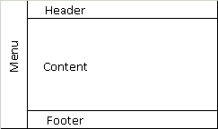

# desafioSiteHTML

## Criando um Site com HTML e CSS

Esse desafio tem como objetivo, criar um site "quase" completo, onde tem o objetivo de demonstrar as habilidades apreendidas no Módulo 02 do Curso de HTML da Dio.me

### Os temas que deverão ser abordados são:

    Formulários
    Estruturação e formatação de texto
    Mídias
    Tabelas

### Além de outros recursos falados nas aulas!

Instruções

    1- Você deve criar um site de uma clínica médica (você escolhe a especialidade)
    2- Este site deve conter o seguinte menu de navegação:
        - Página Principal
        - Sobre a clínica
        - Horário de Atendimento
        - Contato
    3- Deve, obrigatoriamente, utilizar todas os assuntos abordados nas aulas.

Abaixo como cada página deve ser criada e estruturada.

### Estrutura das páginas

Todas as páginas terão que seguir um padrão pré-definido. Como não aprendemos sobre CSS ainda, utilize o arquivo template.html para utilizar como base. Ele segue uma estrutura semelhante a image abaixo.

- Todas as páginas terão que seguir um padrão pré-definido.
   
  
